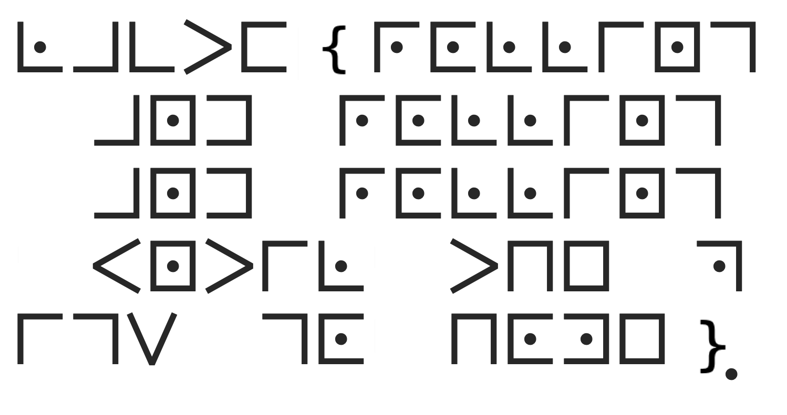

# rolling in the mud

## Author of writeup

Justin Forbes [@justinforbes](https://twitter.com/justinforbes)

## Challenge

> uugh, these pigs in my pen are making a complete mess! They're rolling all over the place!
>
>Anyway, can you decode this cipher they gave me, almost throwing it at me while rolling around?
>
>Answer in lowercase with symbols. In the image, { and } are characters that should appear in your flag, and replace spaces with _.

## Attachements

## Solution

The ciphertext was quickly identified as pigpen, however when using the online tool [https://www.dcode.fr/pigpen-cipher](https://www.dcode.fr/pigpen-cipher) it did not decode into anything looking like a flag.

After rereading the challenge I opened the image in Windows Photos and flipped the image to get this:

This was then able to be decoded to recover the flag.
