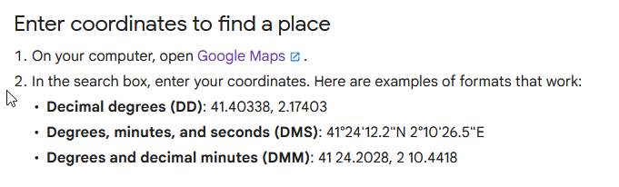
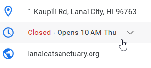

# CATS!

## Author of writeup

Pat Natali

## Challenge

> CATS OMG I CAN'T BELIEVE HOW MANY CATS ARE IN THIS IMAGE I NEED TO VISIT CAN YOU FIGURE OUT THE NAME OF THIS CAT HEAVEN?
>
> Answer is the domain of the website for this location. For example, if the answer was ucla, the flag would be lactf{ucla.edu}.


## Solution

An easy one. Pull up the jpeg's EXIF data. You'll find coordinates. The absolute easiest way to do this from Kali linux is to download the image and run exiftool on it.

```
$ exiftool CATS.jpeg | grep GPS
GPS Version ID                  : 2.3.0.0
GPS Map Datum                   : WGS-84
GPS Latitude                    : 20 deg 47' 27.52" N
GPS Longitude                   : 156 deg 57' 50.03" W
GPS Latitude Ref                : North
GPS Longitude Ref               : West
GPS Position                    : 20 deg 47' 27.52" N, 156 deg 57' 50.03" W
```

Look up the coordinates on Google Maps and find the name of the cat sanctuary. These coordinates are in Decimal Minutes Seconds format.



[This link will do all the work for you. Just zoom in a bit to find the sanctuary.](https://goo.gl/maps/s2h8cZwEKwySpkrt8)



