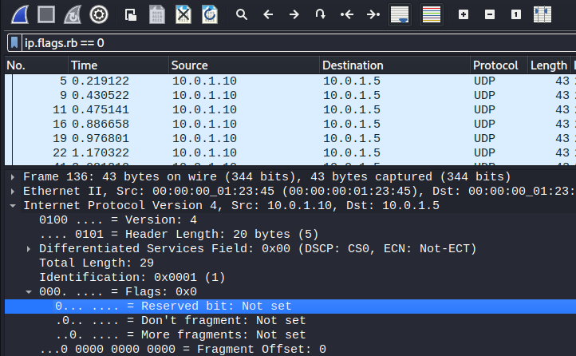
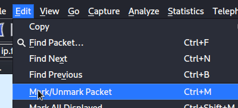
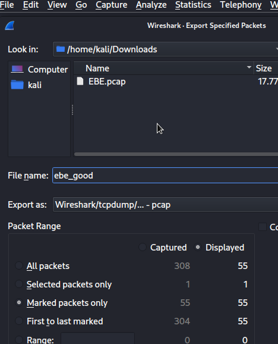
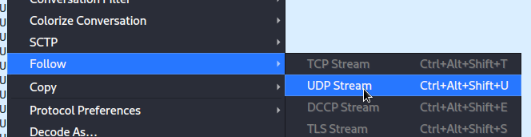
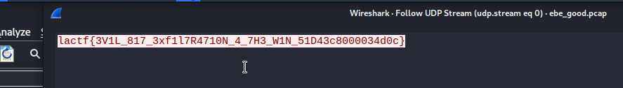

# EBE

## Author of writeup

Pat Natali

## Challenge

> I was trying to send a flag to my friend over UDP, one character at a  time, but it got corrupted! I think someone else was messing around with me and sent extra bytes, though it seems like they actually abided by  RFC 3514 for once. Can you get the flag?

## Solution

Here we have to do some basic filtering in Wireshark. We want to follow a UDP stream to get the flag HOWEVER there is a built in limitation to Wireshark that it can not filter out specific packets. So, we will have to export only the packets that we want and then view the UDP stream.

If they have this reserved bit set to 1, it's garbage. RFC 3514 appears to be an IPv4 joke. So, we are looking for `ip.flags.rb == 0` for legit packets. Next, we have to start marking packets to export.

Use `File > Export specified packets` and then select `Marked packets only` and export them. Then re-open this new packet capture file with our new clean data. Follow the new clean UDP stream.

Then you'll clearly see the flag is the only thing in the conversation.

