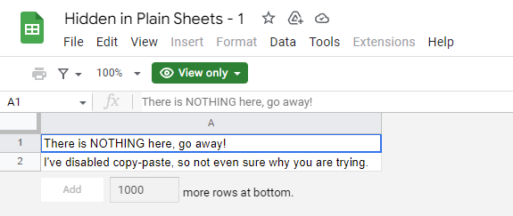
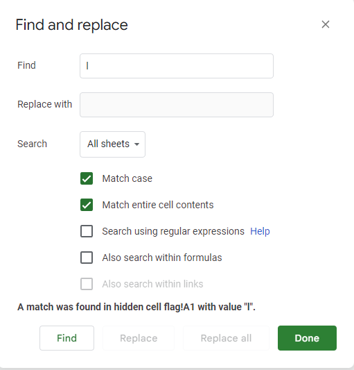
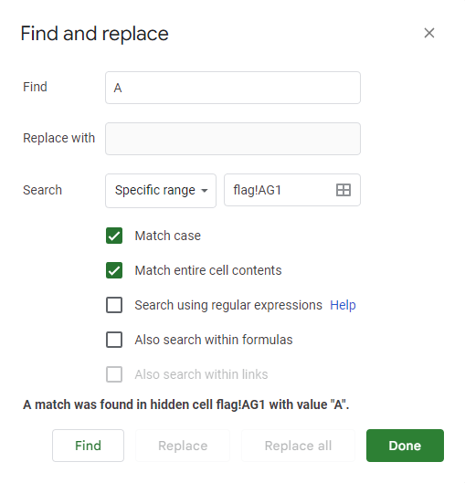

# hidden in plain sheets

## Author of writeup

Justin Forbes [@justinforbes](https://twitter.com/justinforbes)

## Challenge

> I found this google sheets link on the internet. I'm sure it's hiding something, but I can't find anything? Can you find the flag?

## Attachements

The challenge contianed three (3) links to identical Google Sheets documents.

## Solution

The Google Sheet was heavily locked down preventing access to the page containing the flag.
However, the team soon discovered that we could identify characters in the hidden sheet using the "Find and Replace" menu.

This got us started and allowed us to see that each letter of the flag was in a seperate cell on the hidden sheet.
However, our initial technique only allowed us to identify the first instance of a letter, number, or symbol.
We were able to change the search criteria to specify the exact cell we wanted to search which enabled us to find the full flag.

The benefit of combining these techniques is that we didn't need to search the entire keyspace for each cell, after searching the entire key space of the document we only needed to search for repeat characters.
Eventually we were able to determine the flag.
