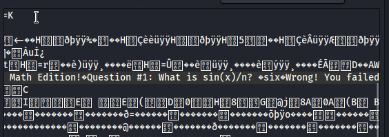

# finals-simulator

## Author of writeup

Pat Natali

## Challenge

> Don't you love taking finals? Don't you wish you could do it not only during finals  week, but during every week? Fret no more, Finals Simulator 2023 has got your back! If you install now and get an A+ on your simulated final,  you'll even get the limited time Flag DLC for free! Also, after numerous reports of cheating we've installed an anti-cheating mechanism so  people actually have to solve the problem.
>
> Connect to it at `nc lac.tf 31132`

## Solution

This was a simple reverse engineering challenge on a binary.

)

The first question can be answered simply by looking in the binary.

The second question I had to calculate and of course realized it was 13371337. I didn't save my original calculation--I used a debugger to find the answer.

The last question has an anti-cheat mechanism involved that I had to reverse engineer by reading the assembly code.

```
strang = "log cabin"
bytez = bytearray()
bytez.extend(map(ord, strang))
print(bytez)

new_bytez = bytearray()
their_checksum = bytearray(b"\x0E\xC9\x9D\xB8\x26\x83\x26\x41\x74\xE9\x26\xA5\x83\x94\x0E\x63\x37\x37\x37")
random_fd = 0xfd

for byte in bytez:
    placeholder = byte
    placeholder = placeholder << 4
    placeholder += byte
    divided = placeholder // random_fd
    remainder = placeholder % random_fd
    print(hex(placeholder), hex(divided), hex(remainder))
    new_bytez.append(remainder)

last_bytez = bytearray(list(range(1, 255)))
translationz = dict()
for byte in last_bytez:
    placeholder = byte
    placeholder = placeholder << 4
    placeholder += byte
    divided = placeholder // random_fd
    remainder = placeholder % random_fd
    translationz[remainder] = chr(byte)
    print(hex(remainder), hex(byte), byte)


for byte in their_checksum:
    if translationz[byte]:
        print(translationz[byte])
```

`their_checksum` in the above example is pulled directly out of the stack during the final. The `random_fd` is just a `0xfd` they hardcoded into the system to be used for their checksum calculation. I decided that the easiest way to handle this was to run the algorithm on all the possible values of bytes (1-255) and then generate a table mapping values to encoded bytes. I then applied the table to the checksum to recover the plaintext answer `it's a log cabin!!!`
