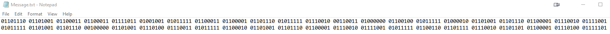
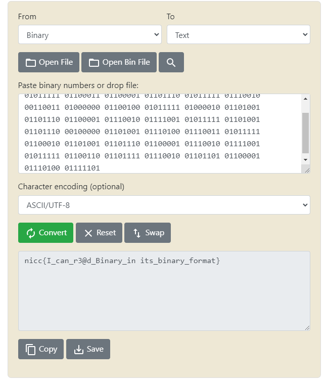

# Binary Bens0n

## Author of writeup

Justin Forbes [@justinforbes](https://twitter.com/justinforbes)

## Challenge

> Old Professor Benson has left this message behine, we thing it has a flag.
>
> Can you decrypt it and get the message he left behind for us?

## Attachements

[Message.txt](../images/Message.txt)

## Solution

Opening the Message.txt file revealed what appeared to be a binary representation of ascii text.

A quick Google search found a website for easily converting the binary back to ascii. <https://www.rapidtables.com/convert/number/binary-to-ascii.html>

