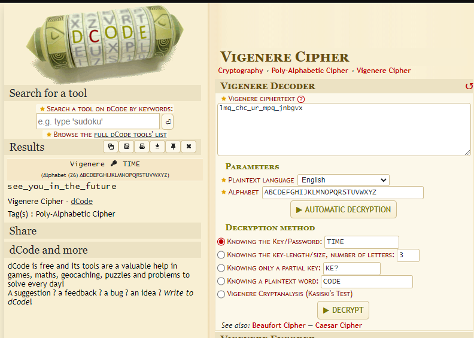

# Dear Tom

## Author of writeup

Justin Forbes [@justinforbes](https://twitter.com/justinforbes)

## Challenge

> Keys are hard to memorize, especially with tests coming up.
>
> I guess whoever has been breaking in around campus is struggling to keep things straight, too.
>
> We found a message left up on a terminal with a post it next to it.
>
> We think it might be a key to solving the message that was left up, but haven't cracked it just yet. Think you could?
>
> lmq_chc_ur_mpq_jnbgvx

## Attachements

[stickynote.png](../images/stickynote.png)

## Solution

The stickynote.png appears to contain the decryption key which is "TIME".

Using the website: <https://www.dcode.fr/vigenere-cipher>

We get the decrypted flag:

