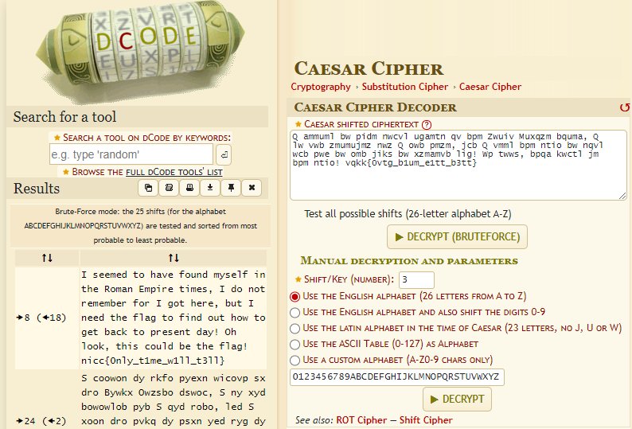

# Hours Behind

## Author of writeup

Justin Forbes [@justinforbes](https://twitter.com/justinforbes)

## Challenge

> One of our members found this code in a lab. It looks like it was sent from a different time, I think the date said the year 8 AD...
>
> Q ammuml bw pidm nwcvl ugamtn qv bpm Zwuiv Muxqzm bquma, Q lw vwb zmumujmz nwz Q owb pmzm, jcb Q vmml bpm ntio bw nqvl wcb pwe bw omb jiks bw xzmamvb lig! Wp twws, bpqa kwctl jm bpm ntio! vqkk{0vtg_b1um_e1tt_b3tt}
>
> It's encrypted, but how do we get the right answer...

## Solution

The encoded text appears to be using a Caesar cipher so we used the tool on this website to decrypt it: <https://www.dcode.fr/caesar-cipher>

The decrypted flag:

