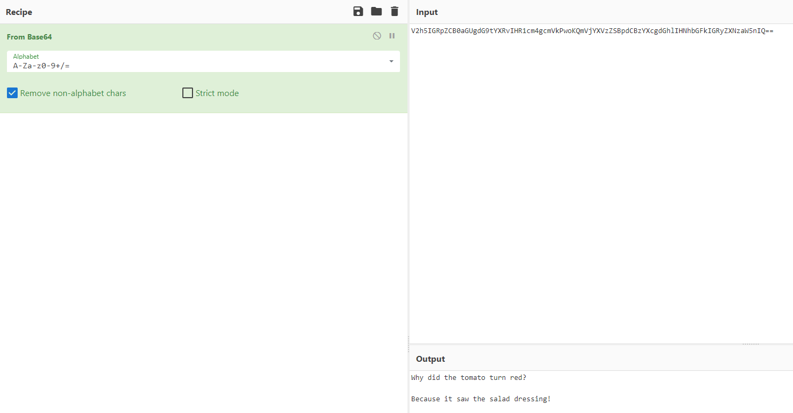

# Tell Me a Joke

## Author of writeup

Justin Forbes [@justinforbes](https://twitter.com/justinforbes)

## Challenge

> I asked ChatGPT to tell me a joke, but it's encoded. Can you figure out what it is?
>
> V2h5IGRpZCB0aGUgdG9tYXRvIHR1cm4gcmVkPwoKQmVjYXVzZSBpdCBzYXcgdGhlIHNhbGFkIGRyZXNzaW5nIQ==
>
> Format: nicc{words can be spaced}

## Solution

The double = characters at the end of the text indicate it is most likely using base64 encoding. We can use CyberChef to easily decode this: <https://gchq.github.io/CyberChef/>

