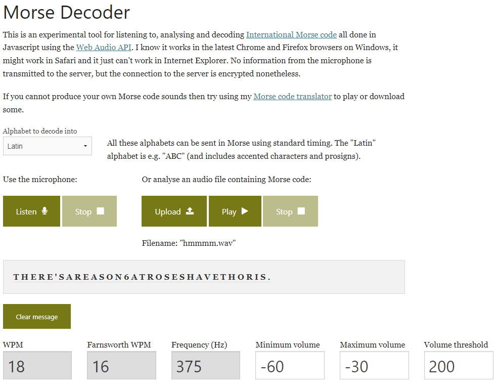

# What's camping withou s'morse?

## Author of writeup

Justin Forbes [@justinforbes](https://twitter.com/justinforbes)

## Challenge

> Some of the NICC members were trying to get away camping after midterms, but all of their headphones immediately started blaring this sound when they tried to leave campus.
>
> Someone grabbed a recording, maybe we can piece it together?
>
> Format: nicc{words_separated_by_underscores}

## Attachements

[hmmmm.wav](../images/hmmmm.wav)

## Solution

Based on the title of the challenge and the audio we determined this was morse code. Using this website we can decode it: <https://morsecode.world/international/decoder/audio-decoder-adaptive.html>

