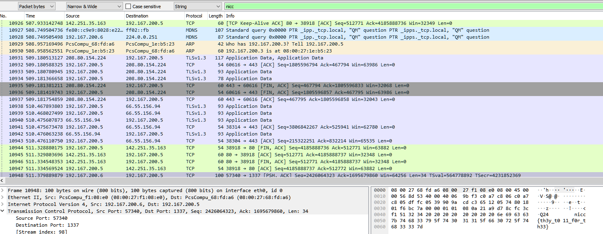

# No Expectation of Privacy

## Author of writeup

Justin Forbes [@justinforbes](https://twitter.com/justinforbes)

## Challenge

> We've been monitoring data coming and going from around campus. Might be worth looking into it to see if anything weird stands out.
>
> Could be that's how whoever is behind the weird stuff on campus is communicating? We're looking for something from someone named RB.

## Attachements

[caughtin2023.pcapng](../images/caughtin2023.pcapng)

## Solution

Using the find feature within wireshark and searching for the beginning of the flag string revealed the packet containing the flag.

