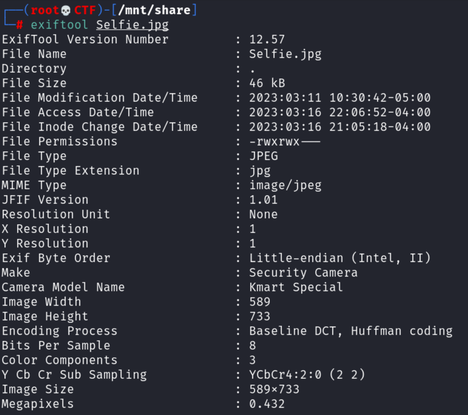

# Say Cheese!

## Author of writeup

Justin Forbes [@justinforbes](https://twitter.com/justinforbes)

## Challenge

> This photo was given to us and we believe this man may play an important part into all this craziness. Can you find out what the make and model of the device used to take the selfie was? Flag will be in this format
>
> nicc{MakeWord1_MakeWord2_ModelWord1_ModelWord2}

## Attachements

## Solution

The wording of the challenge led us to use exiftool to extract the metadata from the image.

