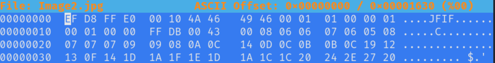
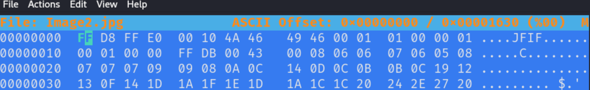

# Warped Image

## Author of writeup

Justin Forbes [@justinforbes](https://twitter.com/justinforbes)

## Challenge

> This image was warped through time and something must have happened to it as we an no longer see it!
>
> Can you help us so we can see the image?

## Attachements

[Image2.jpg](../images/Image2.jpg)

## Solution

Attempting to open the image generated an error due to a corrupt file. We used hexedit to ensure the jpg magic bytes were present and noticed an error.

Modifying the hex to include the proper magic bytes allowed the file to be opened and revealed the flag.

