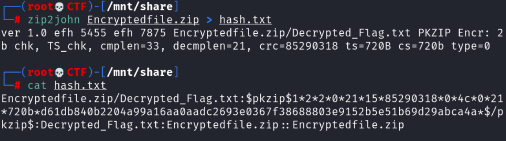
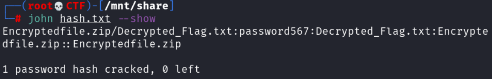
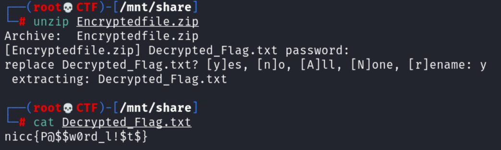

# Old Habits Die Hard

## Author of writeup

Justin Forbes [@justinforbes](https://twitter.com/justinforbes)

## Challenge

> We found this zip file but its encrypted so we can't read the contents. Do you think you could crack it?

## Attachements

## Solution

Using the tool zip2john we created a hash file that can be used with John the ripper.

Then we used John the Ripper to crack the hash and retrieve the password.

Finally we used the password to unzip the archive and retrieve the flag.

