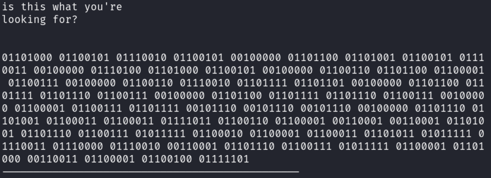
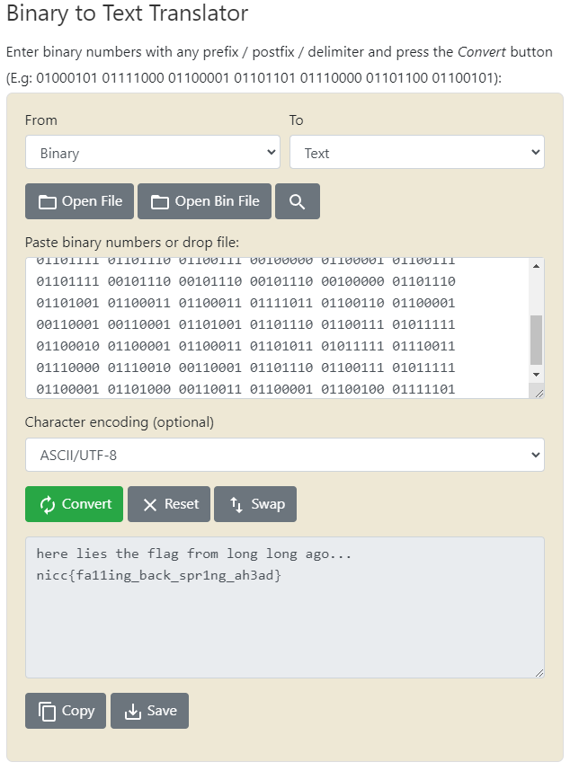

# Backward Time

## Author of writeup

Justin Forbes [@justinforbes](https://twitter.com/justinforbes)

## Challenge

> This pic we recovered from a lab pc seems suspect.
>
> Can you check it out and see if anything stands out?

## Attachements

## Solution

The image contained no obvious clues as to what the flag was. Running strings on the file revealed binary data within the file.

We then converted the binary to ascii to reveal the flag.

