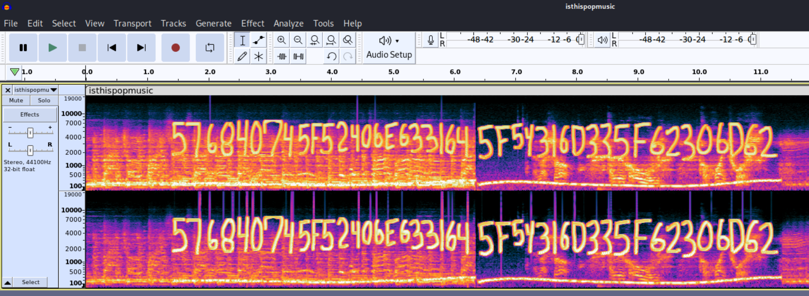
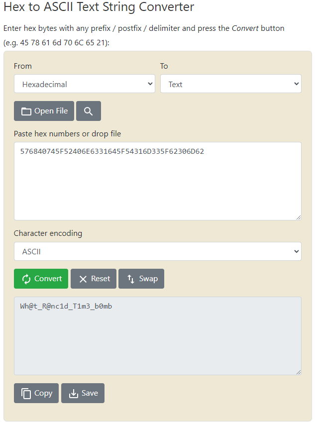

# Everybody's SO Creative

## Author of writeup

Justin Forbes [@justinforbes](https://twitter.com/justinforbes)

## Challenge

> Ugh, why do they keep trying to make good music sound bad? There's NO way this is what the DJ intended to play. I can't believe they had the audacity to do this!

## Attachements

[isthispopmusic.wav](../images/isthispopmusic.wav)

## Solution

Loading the audio file in audacity and viewing the spectrogram revealed hex characters.

Converting the hex to ascii revealed the flag.

