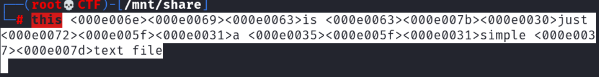
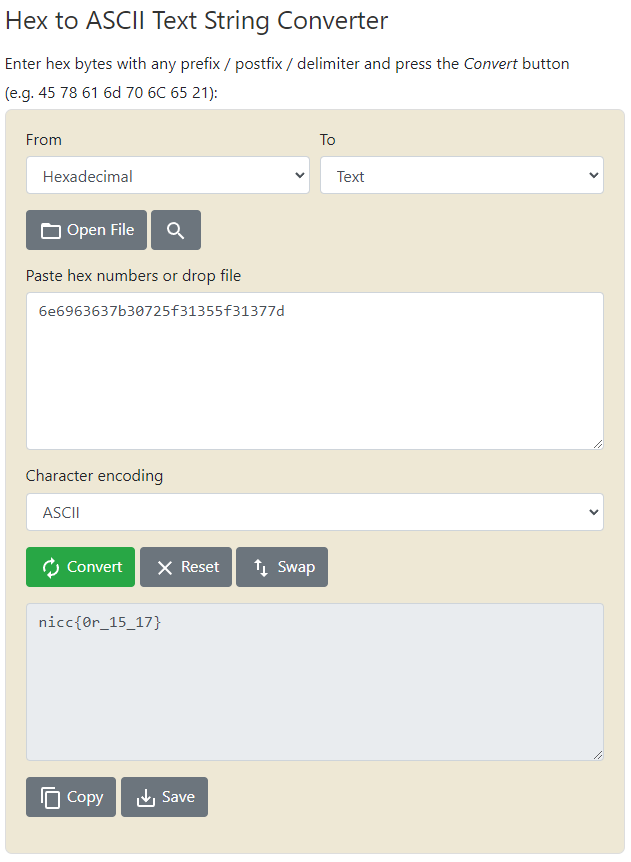

# plainsight

## Author of writeup

Justin Forbes [@justinforbes](https://twitter.com/justinforbes)

## Challenge

> this 󠁮󠁩󠁣is 󠁣󠁻󠀰just 󠁲󠁟󠀱a 󠀵󠁟󠀱simple 󠀷󠁽text file

## Solution

Copying the text and attempting to paste it into the command line on Kali revealed hex characters hidden in the text.

Converting the hex to ascii revealed the flag.

