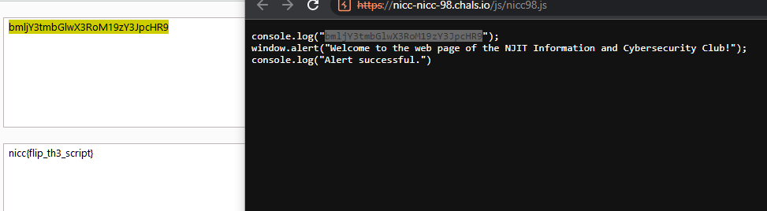

# NICC 98

## Author of writeup

Justin Forbes [@justinforbes](https://twitter.com/justinforbes)

## Challenge

> Here’s an archive of the original NICC website from when we used to be hosted by Geocities! (Cut us some slack, it was 1998.)

## Solution

Viewing the javascript code that is loaded by the website revealed a console message that was base64 encoded. Decoding that revealed the flag.

