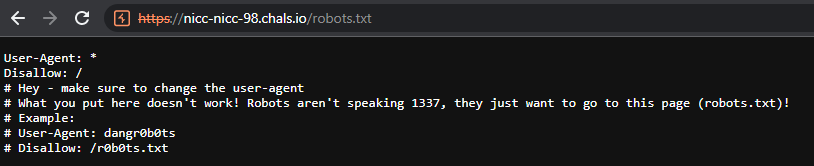
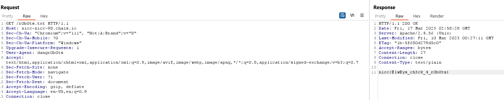

# Th3y d0nt sp3@k 1337

## Author of writeup

Justin Forbes [@justinforbes](https://twitter.com/justinforbes)

## Challenge

> With all of the weirdness happening around campus, we wanted to make sure we stop robots from crawling around where they don't belong.
>
> Unfortunately, it was... misconfigured... by an over-eager web member who thought they should use 1337speak instead since they were dealing with robots.
>
> Even worse, they left it on our old site from 1998 somehow!

## Solution

Viewing the robots.txt file shows that only a specific User Agent can access the flag.

Changing the useragent and viewing the specified file reveals the flag.

