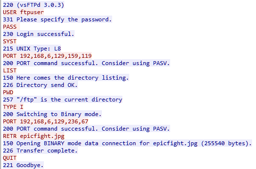
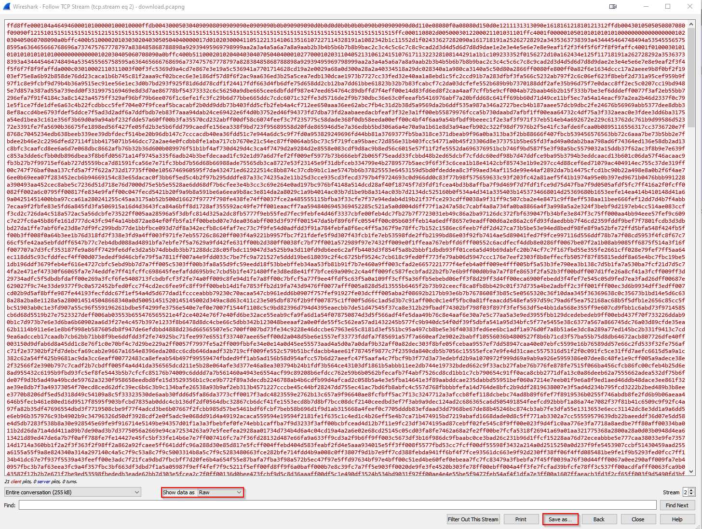
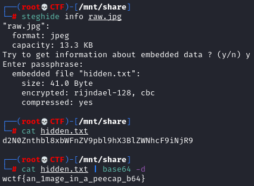

# Dino Trading

## Author of writeup

Justin Forbes [@justinforbes](https://twitter.com/justinforbes)

## Challenge

> I love trading dinosaurs with my friends! I'm sure nobody can see what we're sending, because otherwise, my dinosaurs might get taken.

## Attachements

[download.pcapng](../images/download.pcapng)

## Solution

The first step to solving this challenge was to open the pcapng file in Wireshark to determine what is going on. Upon inspection we can see that there is an image being transferred via FTP.

We can identify the actual image transfer by right clicking on one of the packets which shows up as FTP-DATA in the protocol column, then selecting Follow -> TCP Stream. This data looks like random characters but you will notice it says JFIF at the top of the file which tells us that this is a JPG image. Change the "Show data as" drop down bow to RAW and then click on Save as and be sure to save the image with the .jpg extension.

Viewing the image shows some kind of CGI Jurassic Park image.

This made me think that there must be something hidden within the image file itself, most likely using steganography. I ran a suite of stego tools against the image and discovered that something was hidden within the image using the tool steghide. This hidden data was a base64 encoded string that when decoded revealed the flag.

