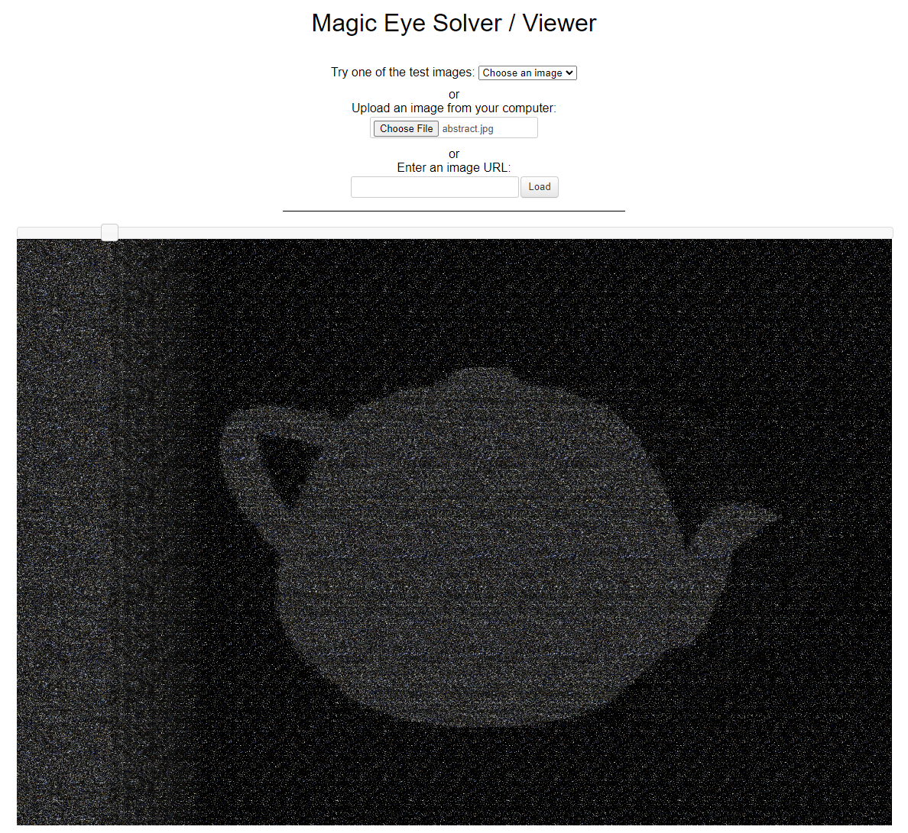

# Abstract Art

## Author of writeup

Justin Forbes [@justinforbes](https://twitter.com/justinforbes)

## Challenge

> I saw this new painting in a gallery by famed painter Otto Stairee O'Graham. Everyone raves about how clearly it represents some common motif, but looking at it just makes me go cross-eyed.
> flag is: wctf{name of object in painting} (hint: it's two syllables)

## Attachements

## Solution

Looking at the image it was clear that this was one of those magic eye images that require you to cross your eyes to view it. I have never been able to successfully view these myself so I found a website which will do it for me. [magic eye website](https://magiceye.ecksdee.co.uk/)

Uploading the abstract.jpg revelaed the image of a teapot which was the flag for this challenge.

